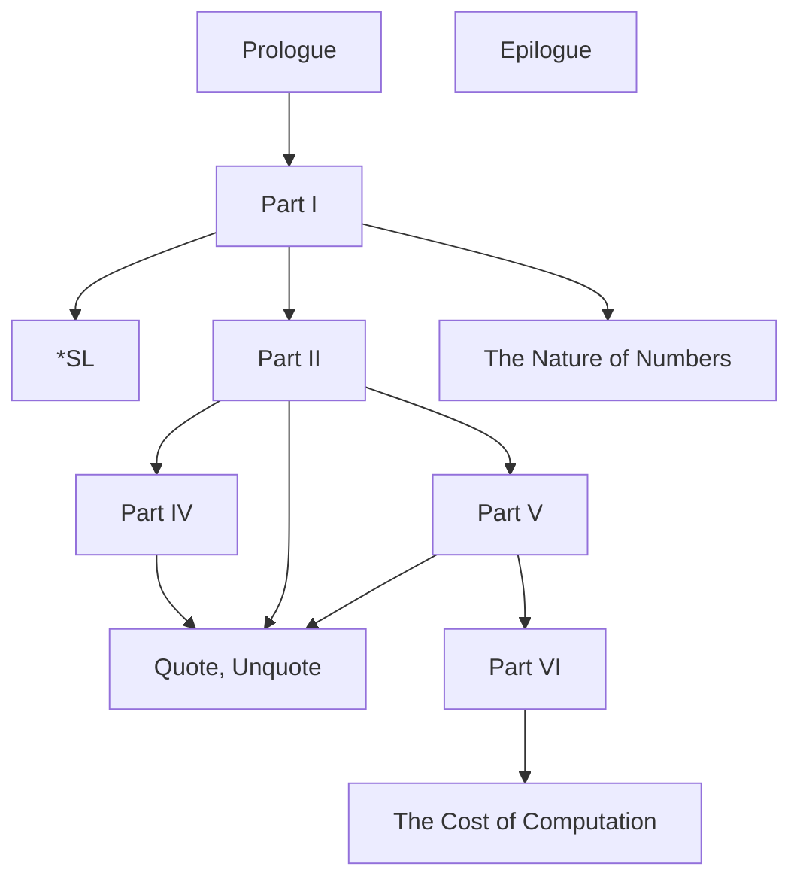

# Preface

https://htdp.org/2023-8-14/Book/part_preface.html

## Systematic Program Design

Function design recipe's basic steps

1. From Problem Analysis to Data Definitions
2. Signature, Purpose Statement, Header
3. Functional Examples
4. Function Template
5. Function Definition
6. Testing

## This Book and Its Parts

The dependencies among parts and intermezzos

```
                    + - - +            + - - +         + - - - - - - - - - - - +
                    | *SL |  - - - - > | III | - - - > | Scope and Abstraction |
                    + - - + |          + - - +         + - - - - - - - - - - - +
                       ^    |
                       |    |             + - - +
                       |     \      - - -> |  IV |
                       |      \   /       + - - +
                       |       \ /
   + - - - - - +    + - +      + - - +     + - - - - - - - - +
   | Prologue  | -> | I | ---> | II  |---> |  Quote, Unquote |
   + - - - - - +    + - +      + - - +     + - - - - - - - - +
                      |           |
                      |           |
                      |           v                 + - - - - - - - - - - - - +
                      |           V - - - > VI ---> | The Cost of Computation |
                      |                             + - - - - - - - - - - - - +
                      v
          + - - - - - - - - - - - - +
          |  The Nature of Numbers  |
          + - - - - - - - - - - - - +

   + - - - - - +
   |  Epilogue |
   + - - - - - +

```

or it can be presented like this


